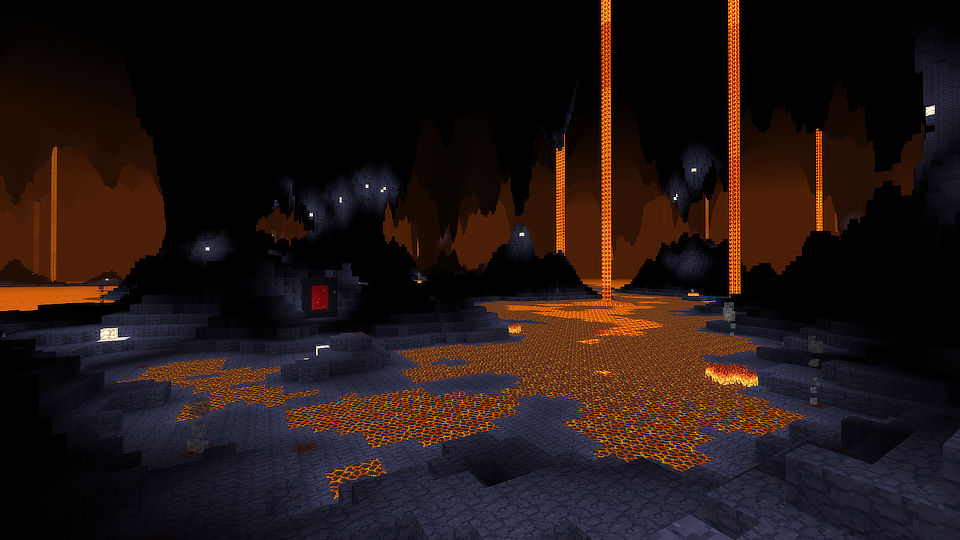

# The Deep Nether (modding template for Minetest)

This is a demonstration of how to add more realms to the [Nether](https://github.com/minetest-mods/nether) (i.e. "nether layers") or to replace the existing Nether mapgen. Enabling multiple different nether layer mods together will create multiple realms layered deeper and deeper. This mod acts as a starting template so you can hit the ground running. 

It's ~400 lines of lua code which when installed allows a portal made of hewn basalt to be opened (the basalt can be obtained by reaching the Mantle region in the Nether - there are islands of basalt in the lava ocean there which can be crafted into hewn basalt). These portals lead to a Nether-like realm the mod creates below the existing Nether.

Rather than taking you back to the surface, a hewn basalt portal opened in the Deep Nether will only take you back to the Nether.

The realm this mod creates is kept simple. It's a template: fork and adapt it, make it richer, make it your own project.

**Mod dependencies:** [Nether](https://github.com/minetest-mods/nether) v3.1+

**Minetest version:** v5.2+

**Screenshots:**

**License:**
[MIT](https://opensource.org/licenses/MIT) for code & config, [Attribution-ShareAlike 4.0 International](http://creativecommons.org/licenses/by-sa/4.0/) for text and media.

